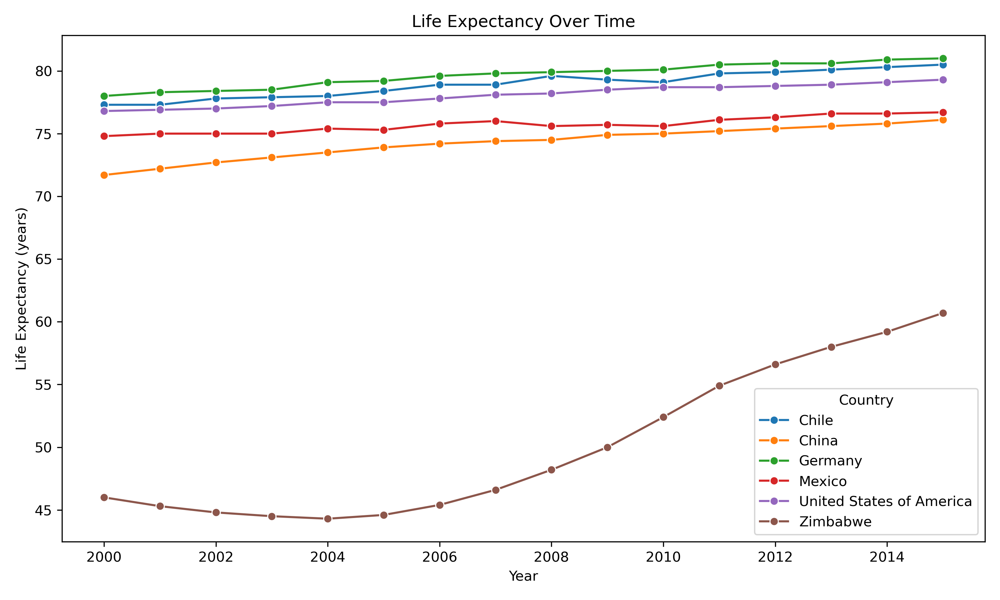
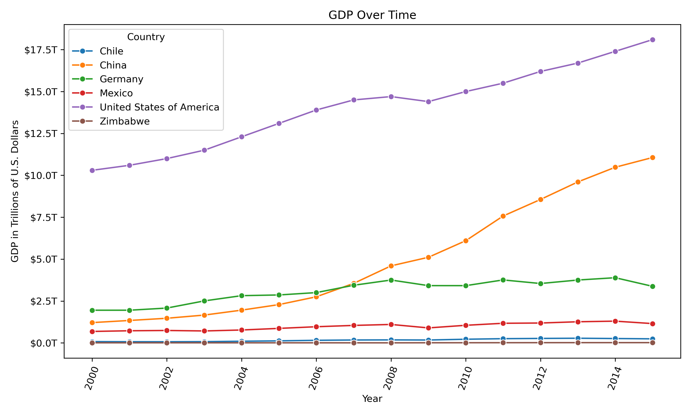
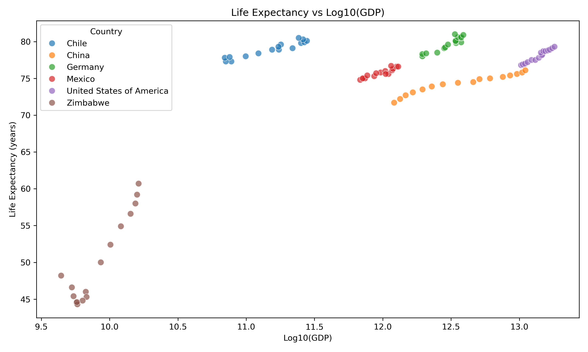
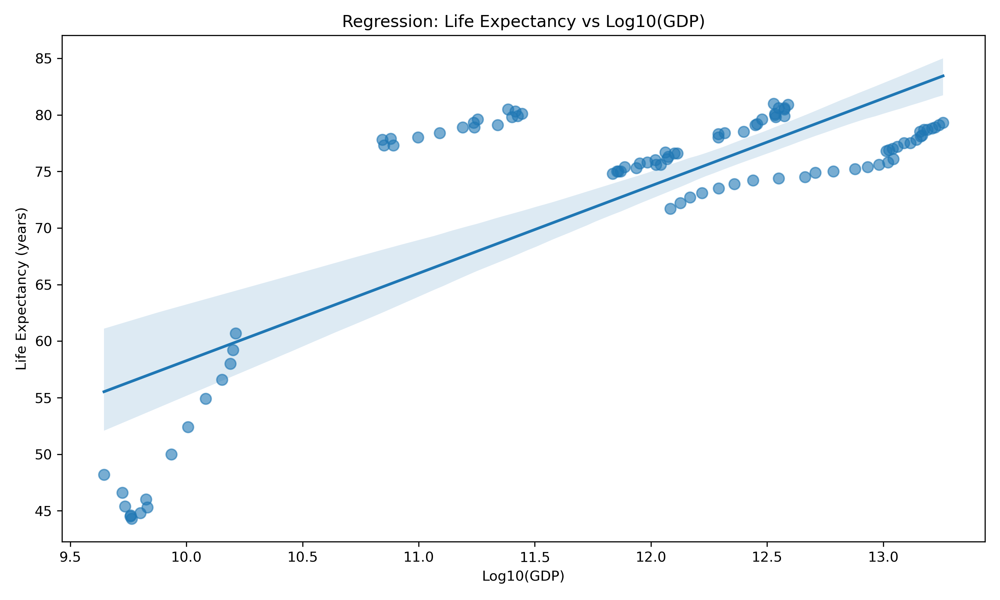
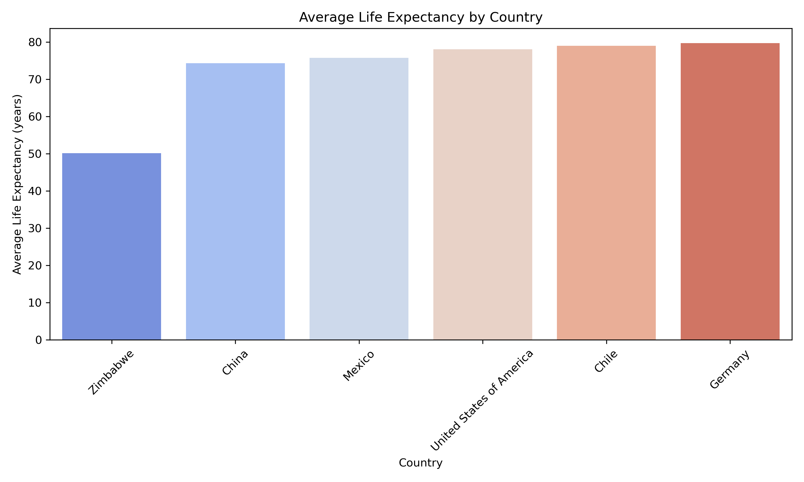
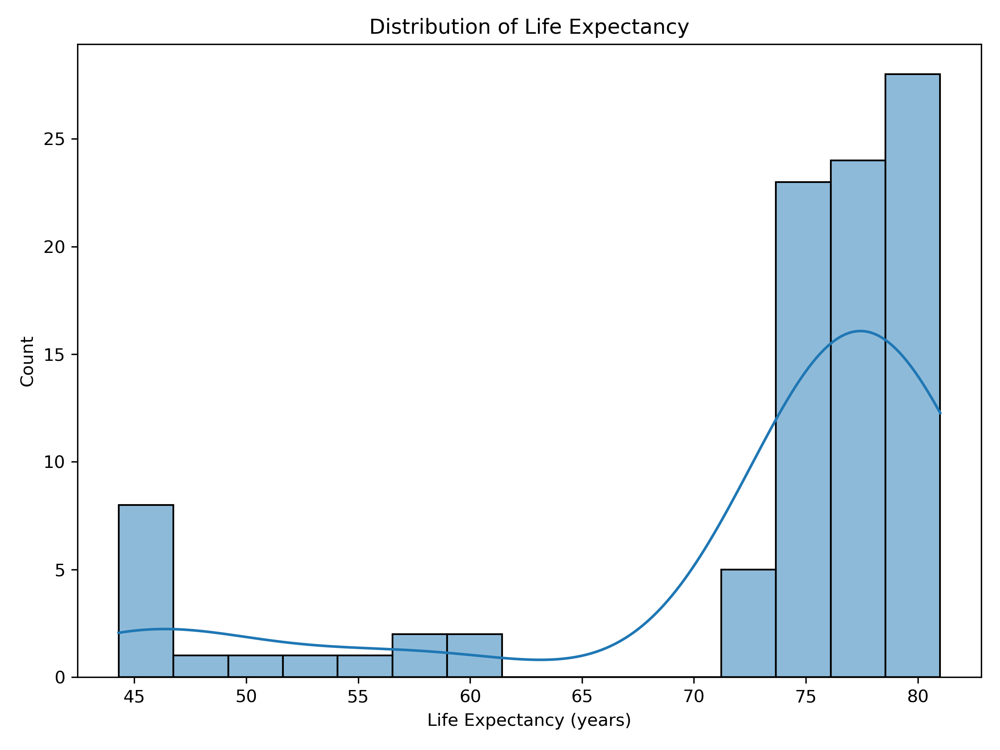
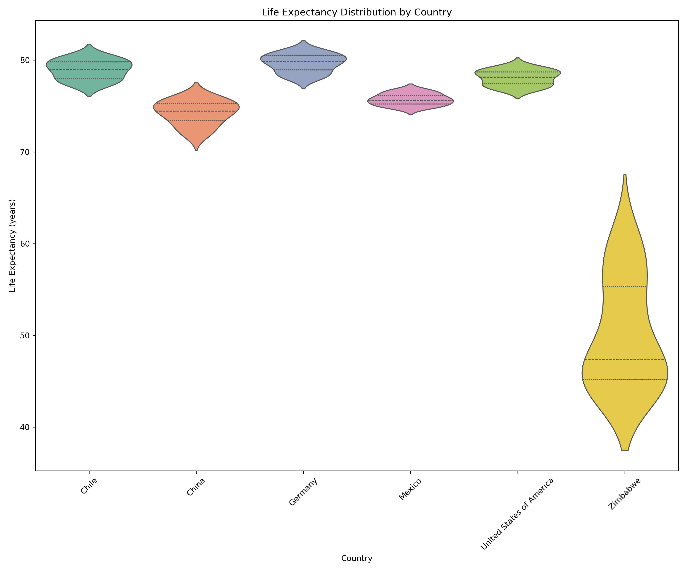
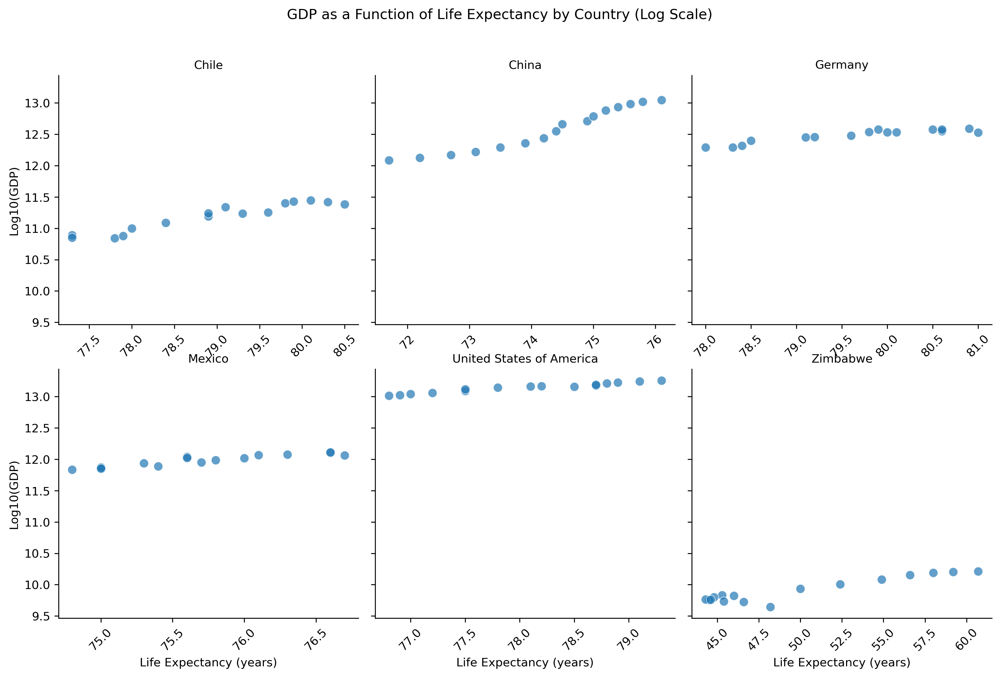
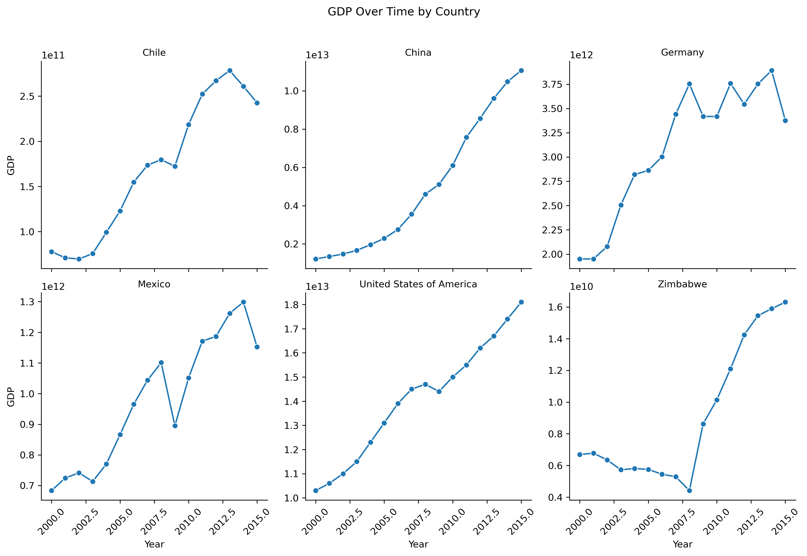

# Investigating the Relationship Between GDP and Life Expectancy

## Introduction

Economic development and public health are often closely related. Countries with stronger economies tend to have better healthcare systems, improved infrastructure, and broader access to essential services. Because of this connection, it is reasonable to ask whether economic growth is associated with longer life expectancy.

In this project, I analyzed data from the World Health Organization (WHO) and the World Bank to explore the relationship between Gross Domestic Product (GDP) and life expectancy across six countries. The goal was to understand whether countries with higher economic output also tend to have populations that live longer.

Using Python and common data science libraries including Pandas, NumPy, Matplotlib, and Seaborn, I explored the dataset through data cleaning, exploratory analysis, and multiple visualizations. These visualizations help highlight patterns between economic growth and population health over time.

The main research question guiding this analysis is:

**Is there a correlation between a country's GDP and the life expectancy of its population??**

By analyzing trends across multiple countries and years, this project aims to provide a clearer picture of how economic development may relate to global health outcomes.

---

# Project Overview

# Project Overview

This project performs exploratory data analysis and visualization to investigate the relationship between economic development and population longevity.

The analysis includes:

- Exploring the dataset
- Visualizing life expectancy trends
- Analyzing GDP growth
- Examining correlations between GDP and life expectancy
- Performing regression analysis
- Visualizing the distribution of life expectancy values
- Comparing life expectancy distributions by country
- Analyzing GDP as a function of life expectancy by country with log-transformed GDP
- Visualizing GDP growth over time by country

The goal is to understand whether economic strength tends to coincide with improvements in population health outcomes.

---

# Dataset

The dataset contains information on **GDP and life expectancy across multiple years for six countries**.

Data Sources:
World Bank  
World Health Organization

Dataset used in this project:
all_data.csv

Columns included in the dataset:

| Column          | Description                      |
| --------------- | -------------------------------- |
| Country         | Country name                     |
| Year            | Year of observation              |
| GDP             | Gross Domestic Product in USD    |
| Life Expectancy | Average life expectancy at birth |

Countries analyzed:

- United States
- China
- Germany
- Chile
- Mexico
- Zimbabwe

---

# Tools Used

The analysis was conducted using the following Python libraries:

- **Pandas** for data manipulation
- **NumPy** for numerical transformations
- **Matplotlib** for visualization
- **Seaborn** for statistical plotting

These tools enabled efficient data loading, exploration, visualization, and statistical analysis.

# Project Structure

Life-Expectancy-GDP-Analysis
│
├── all_data.csv
├── life_expectancy_gdp.ipynb
├── README.md
├── blog_post.md
│
└── images
├── life_expectancy_over_time.png
├── gdp_over_time.png
├── life_expectancy_vs_log_gdp.png
├── regression_life_expectancy_vs_log_gdp.png
├── average_life_expectancy_by_country.png
├── life_expectancy_distribution.png
├── violin_life_expectancy_by_country.png
├── facet_scatter_log_gdp_vs_life_expectancy_by_country.png
└── facet_gdp_by_country.png

---

# Key Visualizations

The project generates several visualizations to analyze patterns in the data.

## Life Expectancy Over Time

Shows how life expectancy changes across countries over time.

---

## GDP Growth Over Time

Illustrates economic growth trends across the countries.

---

## Life Expectancy vs GDP

A scatter plot comparing economic output and life expectancy.

GDP values are log-transformed to better visualize the relationship.

---

## Regression Analysis

A regression line is added to analyze the trend between GDP and life expectancy.

---

## Average Life Expectancy by Country

Comparison of average life expectancy across the countries in the dataset.

---

## Distribution of Life Expectancy

Shows how life expectancy values are distributed across the dataset.

---

## Life Expectancy Distribution by Country

Shows how life expectancy values are distributed for each country.

---

## GDP as a Function of Life Expectancy by Country (Log Scale)

Shows the relationship between life expectancy and log-transformed GDP for each country in separate facet plots.

---

## GDP Growth Over Time by Country

Shows GDP trends over time for each country in separate facet plots.

---

# Key Insights

Several insights emerge from the analysis:

- GDP and life expectancy show a positive relationship.
- Countries with stronger economies tend to have higher life expectancy.
- China demonstrates the most dramatic GDP growth during the observed period.
- Zimbabwe consistently shows the lowest GDP and life expectancy values.
- Log-transforming GDP improves visualization of the relationship.
- Distribution and facet-grid visualizations reveal clearer country-level patterns in economic growth and life expectancy.

---

# Real World Context

One notable pattern in the dataset is China's rapid GDP growth.

Several major economic developments contributed to this growth:

- Market-oriented economic reforms
- Rapid industrialization and urbanization
- Export-driven manufacturing expansion
- Entry into the **World Trade Organization (WTO) in 2001**

These factors accelerated China's integration into the global economy and significantly increased economic output.

---

# Limitations

Although the analysis shows a correlation between GDP and life expectancy, several limitations exist:

- The dataset includes only six countries
- Many factors influence life expectancy beyond economic output
- Correlation does not imply causation

Important additional factors include:

- healthcare access
- education
- sanitation
- public health policies
- social stability

---

# Blog Post

A detailed explanation of the full analysis is available in:

blog_post.md
This file contains the complete walkthrough of the data exploration and visualizations.

---

# How to Run the Project

1. Clone the repository
   git clone https://github.com/sasimgt/Life-Expectancy-GDP-Analysis.git

2. Navigate to the project directory
   cd Life-Expectancy-GDP-Analysis

3. Install required libraries
   pip install pandas numpy matplotlib seaborn

4. Run the analysis script
   jupyter life_expectancy_gdp.ipynb
   All plots will be generated and saved inside the **images/** folder.

---

# Conclusion

This project demonstrates how **data visualization and exploratory analysis** can reveal meaningful patterns between economic development and public health.
While GDP alone does not determine life expectancy, the results suggest that stronger economies often create conditions that support longer lifespans.

Author
Sasi Maddineni
Data Science & AI Enthusiast
